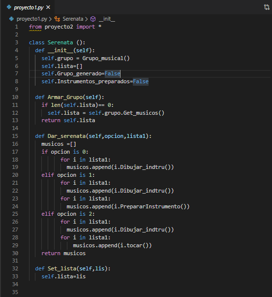

# PRIMER PROYECTO: SERENATA
## Autores: Luis Guillermo Velez - Johan Aguirre Diaz
### Situación problema:
Se quiere dar una serenata con un grupo integrado  con una cantidad de  músicos que varía entre los 5 a 10 integrantes y cada uno de ellos se le debe asignar un instrumento  de manera aleatoria

### Analisis del problema:

Para esta situación los instrumentos que hemos escogido son los que ven en la imagen estos implementan  la interface la cual tiene los métodos Dibujar instru, tocar y Preparar Instrumento esto se sobre escriben en cada una de las clases de los instrumentos. 

### Principios utilizados:
##### Principio abierto/cerrado:
Este principio lo podemos ver ya que por el uso de interfaz para poder heredar los métodos  y poder sobre escribirlo en la clase del instrumento que se ponga. De esta forma podemos ver que se puede extender la cantidad de instrumentos sin tener que modificar el resto del código.

#### Principio de responsabilidad única:

#### Principio de sustitución de liskov:
En este principio podemos evidenciar que las clases bateria,piano,saxofon,guitarra y violin heredan y utilizan todos los métodos de la clase instrumento, y no sobra ningún método.

### Requerimientos
* **Tener instalado python 3.**
* **Tener instalado  flask.**

_Nota: si no se tiene instalado puede seguir el siguiente intructivo._ 

**Instalar python:**
1. Descargamos el instalador de python en [https://www.python.org/downloads/](https://www.python.org/downloads/).

2. Ejecutar el instalador e instalar python:

_Nota: Al instalar algunas versiones de python pueda que no venga con pip (paquete de instalacion para Python) asi la puede instalar._

**Instalar pip:**

1. Descargamos el archivo “get-pip.py”en: [https://pip.pypa.io/en/stable/installing/](https://pip.pypa.io/en/stable/installing/).

2. En la terminal de windows y en la ruta donde tengamos el archivo anteriormente descargado ejecutamos el siguiente comando
     python get-pip.py

_Nota: Necesitaremos instalar Flask para conectar el frontend con el backend y necsitaremos descargar la libreria numpy para poder generar numeros aleatorios ._

**Instalar Flask:**
En la terminal de windows ejecutamos el siguiente comando:
            pip install Flask
            
            
**Instalar numpy:**
Para instalar la libreria numpy,en la terminal de windows ejecutamos el siguiente comando:
            pip install Flask
            
